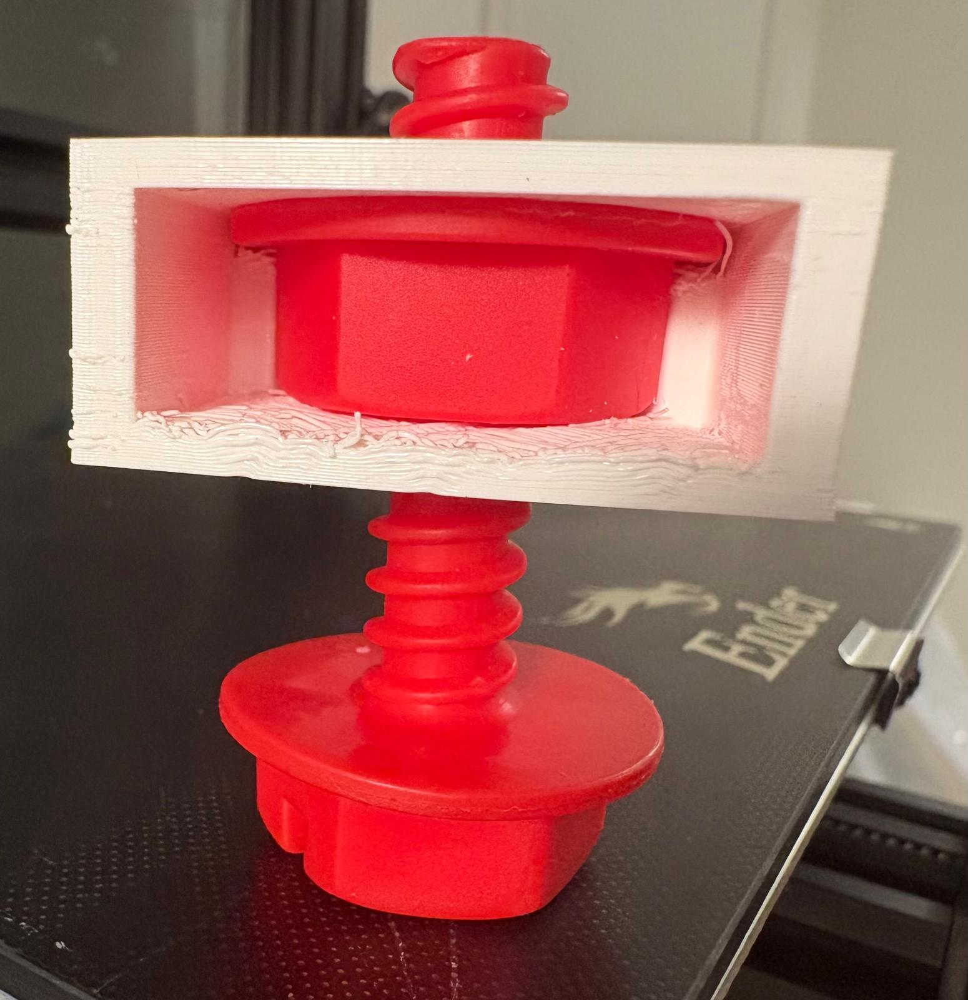
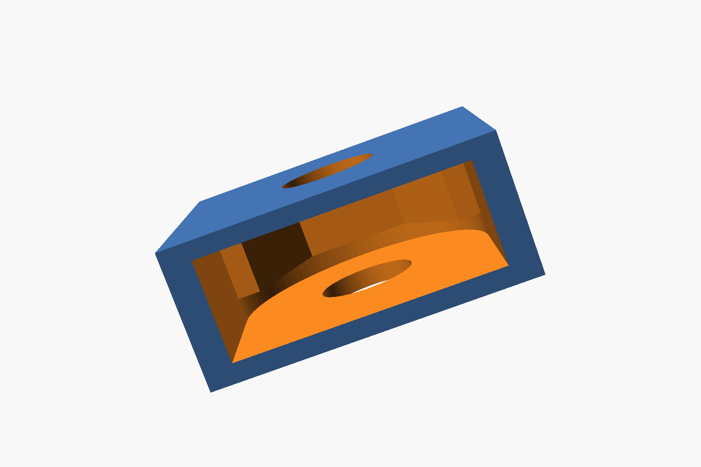

# 3D Printer Notes And CAD Practice

This repo is about exploring how AI can help with CAD for hobby 3D printing.

It combines printer setup notes, simple OpenSCAD models, exported print assets, and iteration on fit, adhesion, and slicer settings.

## Stack Summary

- Printer: `Creality Ender 3`
- CAD: `OpenSCAD`
- Editable model source: `.scad`
- Mesh export for slicing: `.stl`
- Slicer: `Cura`
- Printer file format: `.gcode`
- Material used so far: `PLA`

## Repo Contents

- `3d_printer_notes.md`: setup notes and lessons from getting the Ender 3 running
- `m5_practice_block.scad`: simple captive-nut practice block for an `M5` nut and bolt
- `flanged_nut_side_load_block.scad`: parameterized side-load block for a larger flanged nut
- `flanged_nut_side_load_block.stl`: exported mesh for slicing
- `flanged_nut_side_load_block.gcode`: sliced print file for the Ender 3
- `flanged-nut-side-load-block.jpg`: printed test fit of the side-load flanged nut block

## Workflow

1. Design or edit the part in `OpenSCAD`.
2. Preview with `F5` and render with `F6`.
3. Export to `STL`.
4. Slice the `STL` in `Cura`.
5. Save the `G-code` to an SD card and print on the `Ender 3`.

## Notes From Setup

The current setup notes are in [3d_printer_notes.md](3d_printer_notes.md). The short version:

- the printer is a used `Ender 3`
- bed leveling was a critical early fix
- the first successful print was a door hook from an existing `G-code` file
- printer success mostly comes down to correct nozzle distance from the bed

## Current Focus

- learn how bolt and nut geometry maps into simple printed parts
- use AI to help draft and revise `OpenSCAD` models
- iterate on practical print issues like fit, first-layer adhesion, and slicer temperatures

## Print Photo

Printed flanged nut side-load block test:

## Rotated CAD View (peek into side slot)

